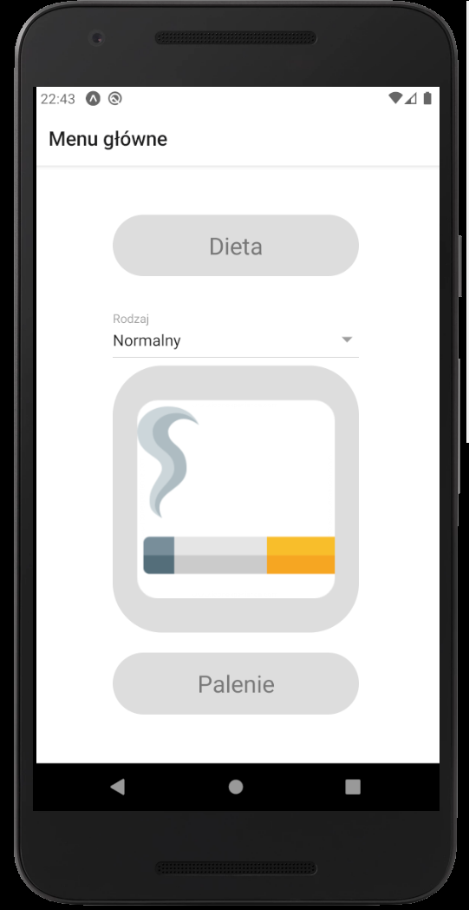
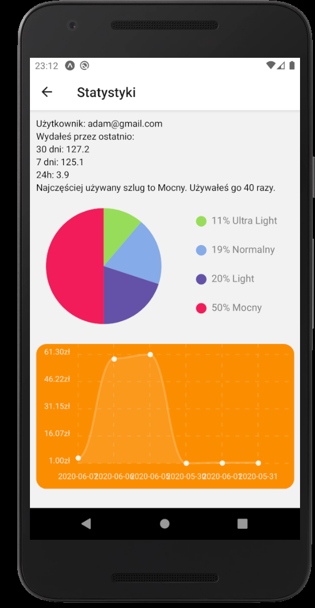
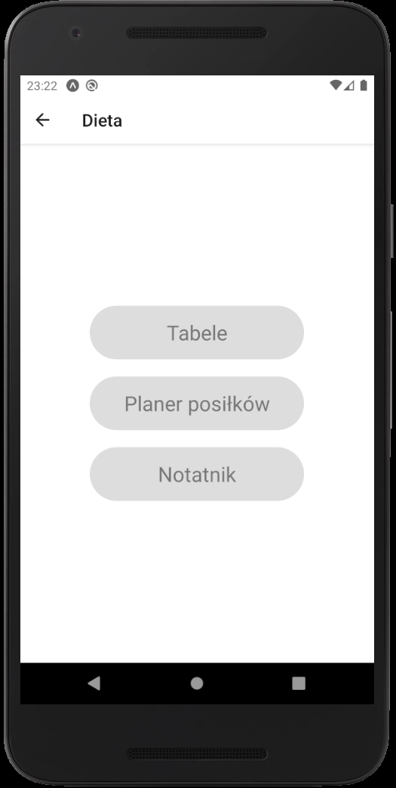
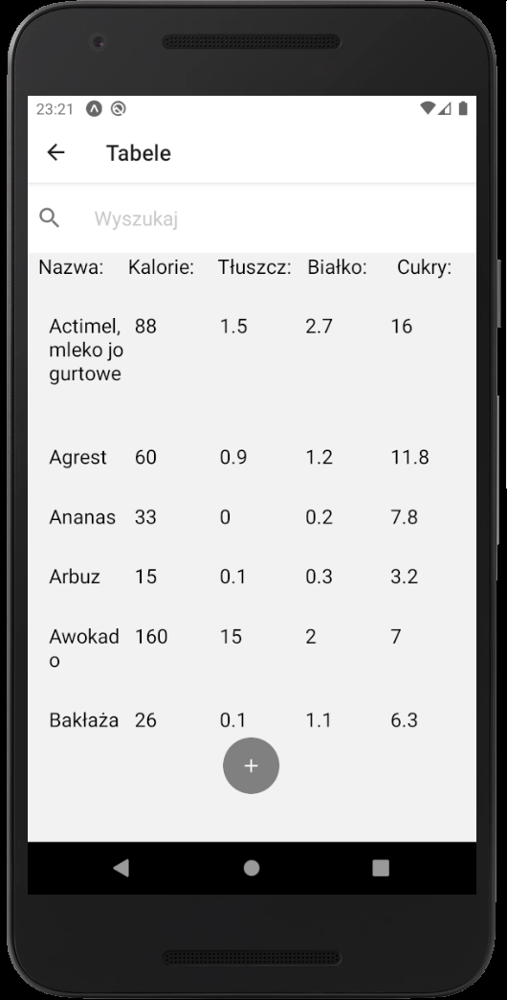
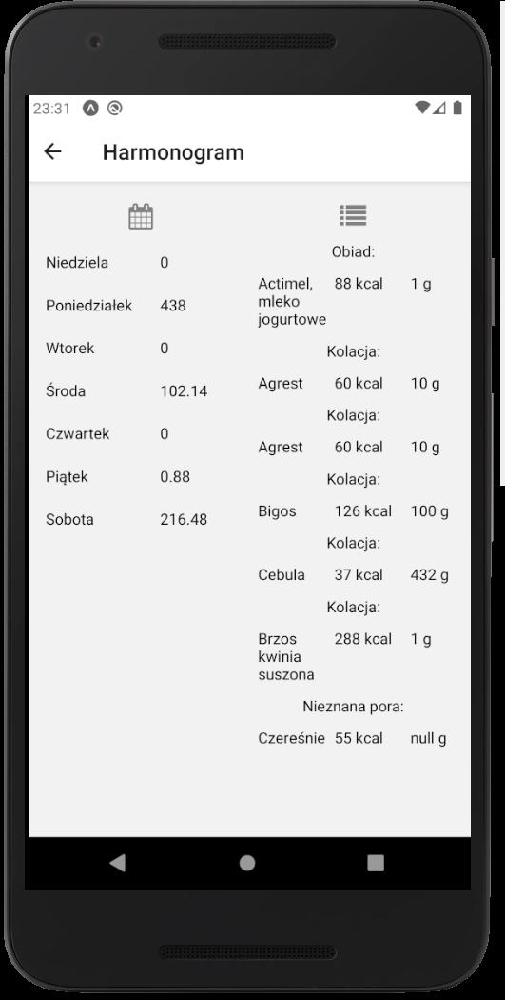
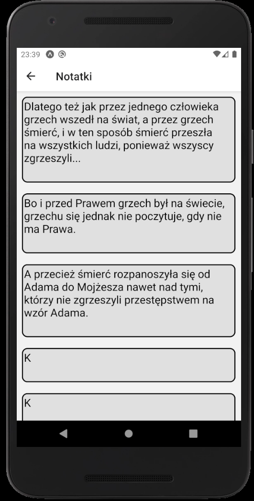

# FIT - Aplikacja Fit Helper do wspierania zdrowego stylu życia
### Wydział Fizyki i Informatyki Stosowanej - Inżynieria Oprogramowania
### Skład zespołu:
1. Piotr Kumala (team-leader)
1. Patryk Chodur
1. Leszek Lorens
1. Maciej Domagalski
1. Tomasz Praszkiewicz
1. Dawid Górka

## Przewodnik użytkownika:
### 1. Autoryzacja  
 W celu korzystania z aplikacji posiadać konto w aplikacji. Jeżeli już posiadasz konto to możesz się zalogować do aplikacji korzystając z formularza logowania. Jeżeli nie posiadasz konta, utwórz je korzystając z formularza rejestracji.
            
### 2. Ekran główny 
Po zalogowaniu będziesz mógł przejść na ekran główny:
      
Na tym ekranie można przejść do modułów: diety lub palenia.
Można również w szybko dodać zapalonego papierosa, oraz wybrać jego rodzaj.
### 3. Moduł palenia
Po kliknięciu w przycisk 'Palenie' na ekranie głównym przejdziesz na stronę statystyk Twojego palenia:
      
Wyświtelają się na nim:
1. Twój adres email
2. Ilość pieniędzy wydanych w ostatnich 30, 7 dniach oraz w ciągu ostatniego dnia
3. Najczęściej używany papieros wraz z ilością użyć
4. Wykres kołowy opisujący procentowy udział różnych typów papierosów w paleniu
5. Wykres wydatków na papierosy w ostatnch 30 dniach
   
### 4. Moduł diety
Po kliknięciu w przycisk Dieta zostaniesz przeniesiony na ekran diety:
  
### 5. Tabele żywności
Po kliknięciu w przycisk 'Tabele' zostaniesz przekierowany na ekran tabeli produktów żywnościowych:
  
Wyświetlane są tutaj przedmioty żywieniowe zawarte w bazie danych, istnieje również możliwość dodawania nowych produktów oraz przeszukiwania już istniejących. Po kliknięciu w produkt w tabeli można go dodać do zjedzonych posiłków po wypełnieniu odpowiedniego formularza.
Kliknięcie w plusa na dole ekranu pozwala na dodanie nowego przedmiotu żywieniowego do bazy danych.

### 6. Planer posiłków
Po kliknięciu w przycisk 'Planer posiłków' w module diety zostaniesz przekierowany na ekran tabeli produktów żywnościowych:  
  
W lewej części ekrany wyświetlają się dni ostatniego tygodnia wraz z kaloriami posiłków zjedzonych w tym dniu. Po kliknięciu w którykolwiek z tych dni wyświtlą się informacje o produktach żywnościowych zjedzonych w danym dniu.

### 7. Notatnik
Po kliknięciu w przycisk 'Notatnik' w module diety zostaniesz przekierowany na ekran notatek:

Możesz tutaj przeglądać swoje notatnik oraz dodawać nowe. 

